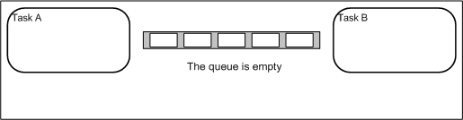
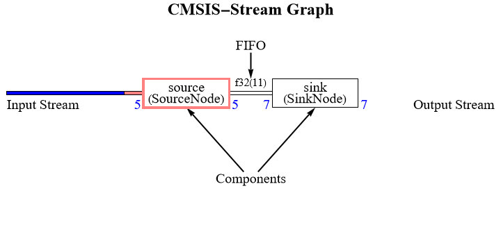

# Data Structure and Data Processing Libraries
<!-- i18n:language-selector:start -->
[中文](README.md) | **English**
<!-- i18n:language-selector:end -->

## Queues

> 

### CBUF

 |  | 

**Link** - [BRBrain/firmware/CBUF.h at master · barraq/BRBrain · GitHub](https://github.com/barraq/BRBrain/blob/master/firmware/CBUF.h)  
**Features** - An elegantly implemented macro-based ring buffer that is simple and easy to use.  

#### Key Points

- It uses a C++ class; create an instance (handle) of the class to serve as the object.

---

### sys/queue

**Link** - [queue.h source code \[glibc/misc/sys/queue.h\] - Codebrowser](https://codebrowser.dev/glibc/glibc/misc/sys/queue.h.html)  
**Features** - Queue and linked-list header files used by Linux and FreeBSD. They are implemented entirely with macros and can link arbitrary types, such as structs.  

#### Key Points

- Usage guide: [Embedded Hodgepodge Weekly | Issue 3](https://mp.weixin.qq.com/s/nDTkTw0RH-6pTjJWelrEfg)
- It uses the `typeof()` operator, so it requires C23 or GNU compiler support. When using an embedded toolchain, change the compiler to GNU;

---

### byte\_queue

 |  | 

**Link** - [byte_queue: A C-language ring queue supporting arbitrary types.](https://gitee.com/Aladdin-Wang/byte_queue)  
**Features** - A C-language ring queue supporting arbitrary types, wrapped with macros and simple to use.  

#### Key Points

---

### queue

 |  | 

**Link** - [queue: Very small and convenient general-purpose queue in C language version.](https://gitee.com/Lamdonn/queue)  
**Features** - A general-purpose C queue supporting arbitrary data types; simple and efficient to use.  

#### Key Points

---

### Ring-Buffer

 |  | 

**Link** - [AndersKaloer/Ring-Buffer: A simple ring buffer (circular buffer) designed for embedded systems.](https://github.com/AndersKaloer/Ring-Buffer)  
**Features** - A simple and efficient ring-buffer library that is easy to use.  

#### Key Points

- The memory-buffer size must be a power of 2;
- A ring buffer can contain at most `(buf_size - 1)` bytes;

---

### wl\_queue

 |  | 

**Link** - [Aladdin-Wang/wl_queue: A queue supporting arbitrary types.](https://github.com/Aladdin-Wang/wl_queue)  
**Features** - A ring queue supporting arbitrary data types. It uses C overloading techniques and emphasizes coroutine safety.  

#### Key Points

- The code uses the `typeof()` function for type checks. This is not a C standard function and is supported only through extensions in particular compilers;

---

### RingBuffer

 |  | 

**Link** - [XinLiGH/RingBuffer: A ring buffer implemented in imitation of kfifo.](https://github.com/XinLiGH/RingBuffer)  
**Features** - A practical, fully featured ring-buffer library that uses heap-memory allocation.  

#### Key Points

- Usage guide: [An implementation of a ring buffer](https://mp.weixin.qq.com/s/BORniHooGGcoPasFYhY2Xg)

---

### queue

 |  | 

**Link** - [queue: A queue implementation in C with strong extensibility that also supports zero-copy queue reads and writes (suitable for individual elements that use large amounts of memory, effectively reducing function execution time).](https://gitee.com/const-zpc/queue)  
**Features** - A simple, highly extensible queue library that also supports zero-copy queue reads and writes (suitable for individual elements that use large amounts of memory, effectively reducing function execution time).  

#### Key Points

---

### QueueForMcu

 |  | 

**Link** - [xiaoxinpro/QueueForMcu: A queue module implemented for microcontrollers, primarily for 8-bit, 16-bit, and 32-bit microcontroller applications without RTOS, and compatible with most microcontroller platforms.](https://github.com/xiaoxinpro/QueueForMcu)  
**Features** - A queue module for non-RTOS systems that dynamically creates queue objects and buffers.  

#### Key Points

- Usage guide: [QueueForMcu | Queue module for microcontrollers](https://mp.weixin.qq.com/s/JehE4zq4eKVbRghE5smHcg)

---

### ConcurrentQueue

 |  | 

**Link** - [cameron314/concurrentqueue: A fast multi-producer, multi-consumer lock-free concurrent queue for C++11](https://github.com/cameron314/concurrentqueue)  
**Features** - An industrial-grade lock-free queue based on C++; it requires no locks and places strong emphasis on thread safety.  

#### Key Points

---

### LwRB

 |  | 

**Link** - [LwRB latest-develop documentation — LwRB documentation](https://docs.majerle.eu/projects/lwrb/en/latest/)  
**Features** - A professional FIFO ring-buffer library with no dynamic memory allocation, suitable for MDA transfers and focused on thread and interrupt safety.  

#### Key Points

- Usage guide: [A lightweight ring-buffer management library for embedded systems!](https://mp.weixin.qq.com/s/jmgYYWlX-mkhAoL2-MRLFw)
- The callback function handles the events in `lwrb_evt_type_t`.

---

### fifofast

 |  | 

**Link** - [nqtronix/fifofast: A fast, generic fifo for MCUs.](https://github.com/nqtronix/fifofast)  
**Features** - A FIFO library optimized for MCUs, intended to reduce CPU and SRAM consumption as much as possible.  

#### Key Points

---

## Streams

> How to achieve actual flow control (using UART transmission to the user layer as an example):
> 1. Use UART+DMA for data transmission and reception;
> 2. DMA continuously receives data at the UART end, then transfers it to the UART stream buffer when a specified condition is triggered;
> 3. Packetize the stream data and submit it to the UART queue buffer;
> 4. Suspend the data-processing thread and start receive processing (serialization) when data appears in the UART queue buffer;
> 5. The reverse is the same: user data is first sent to the user queue buffer, then received by the data-processing area (deserialization), and finally sent through UART by DMA;
> 
> 

### uart_stream

**Link** - [UART and user data-stream buffer processing - Code snippet - Gitee.com](https://gitee.com/Luyi365/codes/jr7tzaiq6lupefkxh4com60)  
**Features** - A data-stream buffer-processing library for UART data with some general applicability.  

#### Key Points

---

### xprintf

**Link** - [ELM - Embedded String Functions](http://elm-chan.org/fsw/strf/xprintf.html)  
**Features** - Embedded string functions that supplement conventional printf functionality and can dynamically write strings to different peripherals.  

#### Key Points

---

### CMSIS-Stream

 |  | 

**Link** - [ARM-software/CMSIS-Stream: CMSIS-Stream software component](https://github.com/ARM-software/CMSIS-Stream)  
**Features** - An ARM-official data-stream processing component with graphical representations that requires Python and C++ together.  

#### Key Points

- Python generates C++ code from the configuration;

---

## Data Structure Collections

### uthash

 |  | 

**Link** - [troydhanson/uthash: C macros for hash tables and more](https://github.com/troydhanson/uthash)  
**Features** - Provides data-structure libraries for hashes, lists, rings, and more; use them by including only the header file.  

#### Key Points

---

## Databases

### cotParam

 |  | 

**Link** - [cotParam: A lightweight parameter-management framework (C language).](https://gitee.com/cot_package/cot_param)  
**Features** - Manages parameters in a table-driven manner, including default, minimum, and maximum values.  

#### Key Points

- Compared with ordinary variable assignment, it currently differs in two main ways:
  - It supports key-value pairing;
  - It constrains parameter ranges and assigns specified values when a value is out of range;
- Usage guide: [C-language parameter-management code framework - major update](https://mp.weixin.qq.com/s/Q0ROGgkxjDGXyKAxnu-aHQ)

---

### EasyFlash

 |  | 

**Link** - [EasyFlash: A lightweight information-storage solution for IoT devices that turns Flash into a small KV database. For the new-generation version, see https://gitee.com/armink/FlashDB](https://gitee.com/Armink/EasyFlash)  
**Features** - A simple Key-Value database that primarily provides variable KV pairing, IAP data modification (for upgrades), log storage, and other functions.  

#### Key Points

- Log storage requires its companion: [EasyLogger](../log-term-lib/README.md#easylogger);

---

### FlashDB

 |  | 

**Link** - [FlashDB: An ultra-lightweight database supporting KV data and time-series data.](https://gitee.com/Armink/FlashDB)  
**Features** - Provides both KV and TS databases; compared with [EasyFlash](#easyflash), it focuses more on the database itself and provides fewer extra features.  

#### Key Points

- ~~Introduction: FlashDB;~~ (pending release)
- This library can solve the issue of data at Flash addresses being moved during iterative device upgrades because it uses key-value mapping;

---

### Nanopb

 |  | 

**Link** - [Nanopb - protocol buffers with small code size](https://jpa.kapsi.fi/nanopb/)  
**Features** - A lightweight Protobuf implementation supporting C. Protobuf is a data format developed by Google. It can be used for data storage and communication protocols and is independent of language and platform, allowing communication between different devices.  

#### Key Points

- Protocol documentation: [Protocol Buffers Documentation](https://protobuf.dev/)
- Tutorials:
  - [protobuf advantages, disadvantages, and encoding principles - Niuben - Blog Garden](https://www.cnblogs.com/niuben/p/14212711.html)
  - [Protobuf user guide | Welcome to linghutf's blog!](https://linghutf.github.io/2016/06/08/protobuf/)
  - [Protobuf learning - Getting started - Aut - Blog Garden](https://www.cnblogs.com/autyinjing/p/6495103.html)
  - [Embedded Hodgepodge Weekly | Issue 9](https://mp.weixin.qq.com/s/kS05PsqRAfw7GoxB8FeSvA)
  - [How to use Nanopb_ECBG_2024's blog - CSDN Blog](https://blog.csdn.net/weixin_56035008/category_10884684.html)
  - [Protocol Buffers_Xiaozhu Kuaipao Aisheying's blog - CSDN Blog](https://blog.csdn.net/ymzhu385/category_11573002.html)
- This protocol was previously used at a company for real-time interaction between devices and mobile phones over Bluetooth;
- When writing PB files, pay attention to hierarchy. Because PB files can include other files, use an inheritance-oriented design: place common operations such as `get`, `put`, `write`, and `read` at the base operation layer, and different kinds of events at the base event layer;

---

### ITTIA DB

**Link** - [ITTIA | ITTIA DB Safe and Secure Embedded Edge Data Platform](https://www.ittia.com)  
**Lite edition link** - [ITTIA DB Lite | ITTIA](https://www.ittia.com/ittia-db-lite)  
**Features** - A powerful real-time embedded database mainly for embedded systems and IoT devices, used for on-device monitoring, storage, and analysis of time-series data; it requires a commercial license.  

#### Key Points

---

### linq4c

 |  | 

**Link** - [haifenghuang/linq4c: LINQ for C(GroupBy, GroupJoin, Join, Take, Where, Select, etc)](https://github.com/haifenghuang/linq4c)  
**Features** - Implements C# LINQ methods in C.  

#### Key Points

- What is LINQ? It turns a collection of data in code into a database, gives it labels, and operates on it with SQL-like query syntax, enabling more intuitive and concise querying and processing.

---

### SQLite

**Link** - [SQLite Home Page](https://www.sqlite.org/)  
**Features** - The most widely used industry-standard embedded database, using SQL syntax and disk files.  

#### Key Points

- ~~For a detailed explanation, see: SQLite (MySQL);~~ (pending release)

---

## Compression Libraries

### lz4

 |  | 

**Link** - [LZ4 - Extremely fast compression](https://lz4.org/)  
**Features** - An extremely fast lossless compression-algorithm library, suitable for data compression during communication.  

#### Key Points

---

### heatshrink

 |  | 

**Link** - [atomicobject/heatshrink: data compression library for embedded/real-time systems](https://github.com/atomicobject/heatshrink)  
**Features** - An embedded decompression library with extremely low resource consumption. Related documentation is sparse.  

#### Key Points

- It is not yet clear whether it can integrate with a file system to decompress archives created on a PC;

---

### TJpgDec

**Link** - [TJpgDec - Tiny JPEG Decompressor](http://elm-chan.org/fsw/tjpgd/00index.html)  
**Features** - A JPEG image-decompression module optimized for embedded systems.  

#### Key Points

- Supported pixel formats: RGB888, RGB565, or grayscale;

---
