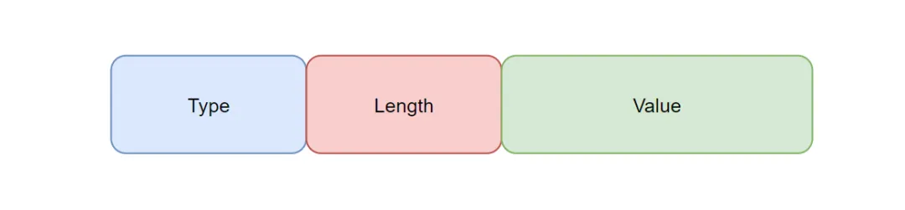

## CGI

An abbreviation of Common Gateway Interface, CGI is an early standard protocol through which a Web server interacts with external programs such as scripts or applications. It lets the Web server forward client requests to an external program for processing and return the result to the client. It is somewhat like a cli<sup>command-line interface (CLI): a text-command-based user interface</sup>, except that CGI calls external programs and interfaces with the Web, whereas cli calls internal code.

#### Characteristics

- **Simple to use**: CGI is very easy to implement: write a script or program and communicate with the Web server through standard input (stdin) and standard output (stdout).
- **Language-independent**: CGI can be implemented in any programming language that can handle standard input and output.
- **Independent process**: Every request starts a new CGI process, which exits after the request is handled. This design completely isolates CGI programs from the Web server and improves security.

### FastCGI

A protocol for improving traditional CGI performance. It addresses the bottleneck caused by CGI having to start a new process for every request. FastCGI uses persistent connections to handle multiple requests: after starting, the server process does not exit immediately, but remains running and waits for new requests, avoiding the overhead of repeatedly starting and stopping processes.

---

## What Is the cURL Command

Reference: [curl](https://curl.se)

A file-transfer tool that works from the command line according to URL rules. Entering the appropriate command and arguments in the command line enables file uploads, downloads, and other operations.

---

## INI

### Introduction

An INI file (Initialization File) is a configuration file with no fixed standard format. It consists of simple text and a simple structure, and is commonly used on Windows operating systems; many programs also use INI files as configuration files. Windows later replaced INI files with the registry. The name INI comes from the initial letters of the English word "Initial", corresponding to its purpose of initializing programs. INI files may also use other extensions, such as `.CFG`, `.CONF`, or `.TXT`.

### Format

An INI file consists of sections, keys, and values.

- **Section**: \[section\]
- **Key-value pair**: name=value
- **Comment**: ; comment text

### Example

```ini
; last modified 1 April 2001 by John Doe
[owner]
name=John Doe
organization=Acme Products

[database]
server=192.0.2.42     ; use IP address in case network name resolution is not working
port=143
file="acme payroll.dat"
```

---

## TLV

Reference: [Custom Embedded Protocols Should Be Packaged in TLV Format](https://mp.weixin.qq.com/s/XQNOnu7XpLTyfUMa5-wxbw)

### Introduction

The most common and simplest custom protocol uses the principle of data self-description. It has an extremely simple structure, strong extensibility, and compatibility.  
It is suitable for efficient and flexible but unprotected scenarios.

### Format



- **Type** 
  Identifies the data type, such as voltage, temperature, or humidity, usually using 1-2 bytes.
- **Length** 
  Indicates the number of bytes in the Value field. It can use fixed or variable-length encoding; for example, one byte (0-255) or a variable-length integer (to save space).
- **Value** 
  The actual data content. Its length is defined by the Length field; for example, a temperature value of 3.11V multiplied by 1000 is encoded as the two-byte integer `0x0C 0x1C`.

---
